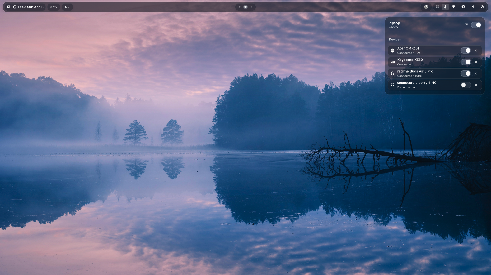
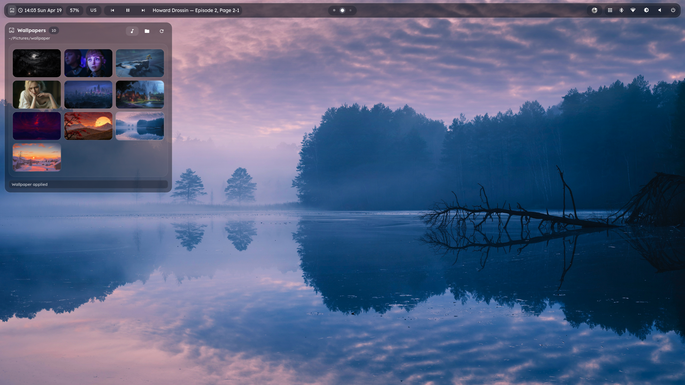

# Obsidian Shell

A compact **AGS v2 / GTK4 / Astal shell** for **Hyprland** and **Niri**, built for a **NixOS + Home Manager** workflow.

## Screenshots

<details>
<summary>Screenshots</summary>





</details>

## Features

- multi-monitor bar
- built-in application launcher
- network and Bluetooth popovers
- MPRIS media controls
- tray integration
- brightness and volume controls
- wallpaper controls
- dark translucent GTK styling

## No fuzzel or rofi required

Obsidian Shell already includes its own launcher, so you do not need **fuzzel** or **rofi** just to open applications.

Example bind:

```ini
hyprland
$mainMod, TAB, exec, obsidian-shell launcher toggle

niri
Mod+Tab { spawn "obsidian-shell" "launcher" "toggle"; }
```

## Blur on Hyprland

To get the intended glass look on **Hyprland**, enable blur for the `obsidian-shell` namespace:

```nix
wayland.windowManager.hyprland.settings.layerrule = [
  "match:namespace ^(obsidian-shell)$, blur 1"
  "match:namespace ^(obsidian-shell)$, blur_popups 1"
  "match:namespace ^(obsidian-shell)$, ignore_alpha 0.2"
];
```

## Installation

This repository ships a **Home Manager module** and is meant to be used from a **flake**.

Add the shell as a flake input:

```nix
{
  inputs = {
    nixpkgs.url = "github:NixOS/nixpkgs/nixos-unstable";
    home-manager.url = "github:nix-community/home-manager";
    home-manager.inputs.nixpkgs.follows = "nixpkgs";

    astal.url = "github:aylur/astal";
    astal.inputs.nixpkgs.follows = "nixpkgs";

    obsidian-shell.url = "github:mny315/Obsidian-shell";
  };
}
```

Make sure Home Manager receives your flake `inputs`, then import and enable the module:

```nix
{
  home-manager.extraSpecialArgs = { inherit inputs; };

  home-manager.users.yourUser = { ... }: {
    imports = [ (inputs.obsidian-shell + /obsidian-shell.nix) ];

    programs.obsidian-shell = {
      enable = true;
    };
  };
}
```


## Autostart

### Hyprland

```ini
exec-once = obsidian-shell
```

### Niri

```kdl
spawn-at-startup "obsidian-shell"
```

## Notes

- `obsidian-shell` in your `PATH` is a Nix wrapper from the built package.
- The wrapper launches the bundled shell from the Nix store, not `~/.config/ags/obsidian-shell`.
- Notifications were removed.
- If you want to change shell behavior, edit the source and rebuild.
- Optional module settings:

```nix
programs.obsidian-shell = {
  enable = true;
  defaultWallpaper = "/path/to/default.png";
  extraRuntimePackages = [ ];
};
```
